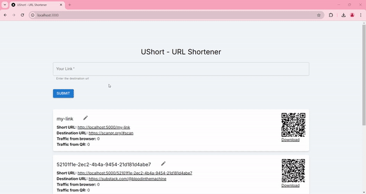
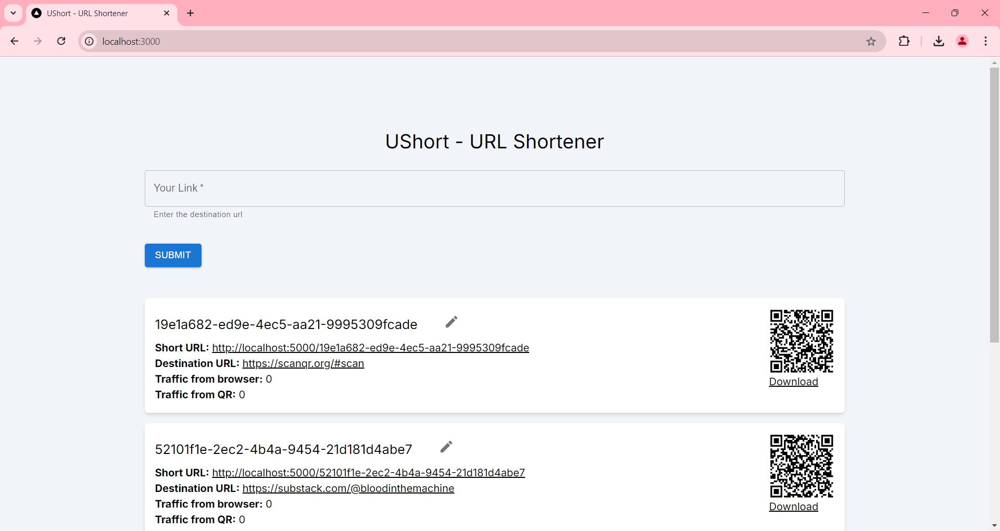
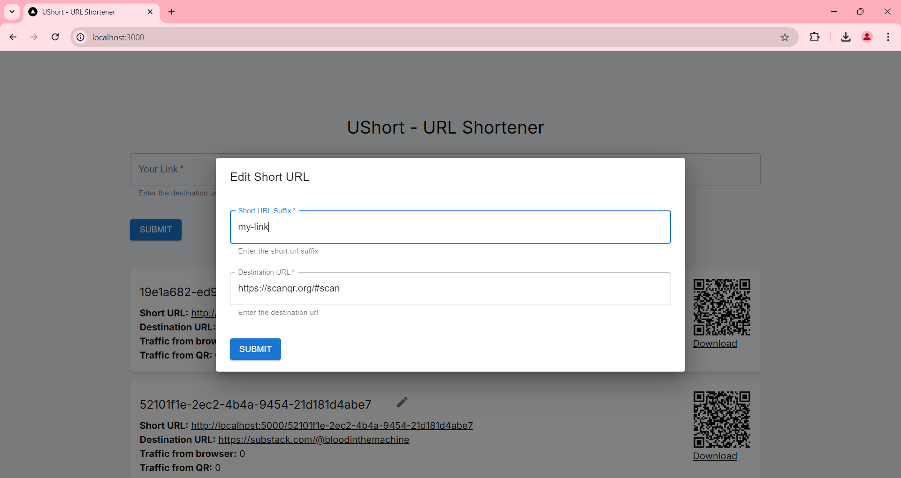
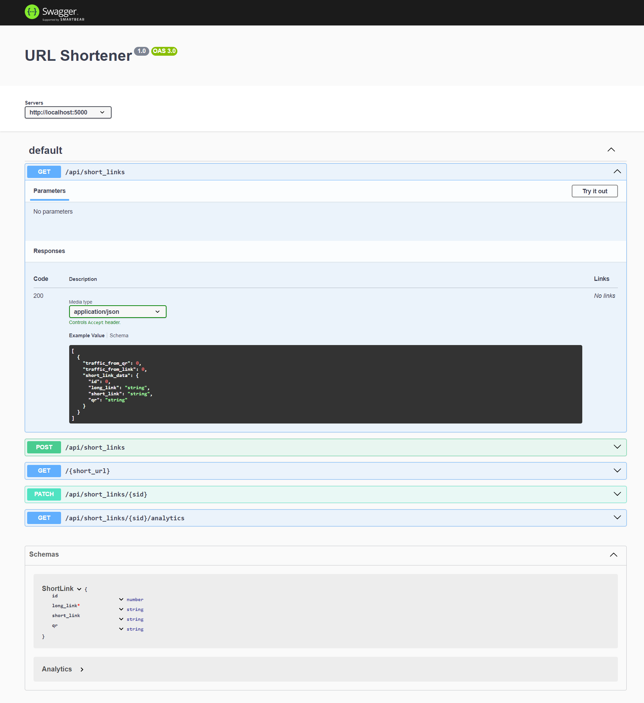

# URL Shortener

Shorten your URLs with this simple URL shortener.
Generate QR codes for your short links.
Track the number of clicks/scans on your short links.


# Demo


# Video Demo
https://drive.google.com/file/d/1J9qMwaN4CYbV4RrB4uQW9qckdbW7yX_N/view?usp=sharing

# Screenshots




# API Documentation


# Tech Stack

- TypeScript
- React.js
- Next.js
- Express.js
- OpenAPI (REST API Validation and Documentation)
- MySQL
- Knex
- Tailwind CSS
- Material UI

# Database Schema

## shortlinks table

```SQL
CREATE TABLE IF NOT EXISTS shortlinks (
    id int unsigned NOT NULL AUTO_INCREMENT,
    short_link varchar(255) NOT NULL,
    long_link text NOT NULL,
    qr text,
    PRIMARY KEY (id),
    UNIQUE KEY (short_link)
);
```

## analytics table

```
CREATE TABLE IF NOT EXISTS analytics (
    id int unsigned NOT NULL AUTO_INCREMENT,
    sid int unsigned NOT NULL,
    source varchar(255) NOT NULL,
    PRIMARY KEY (id),
    FOREIGN KEY (sid) REFERENCES shortlinks(id)
);
```
